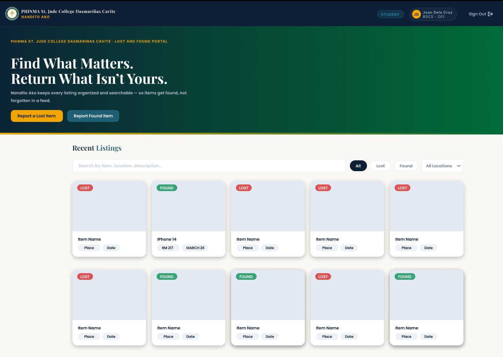
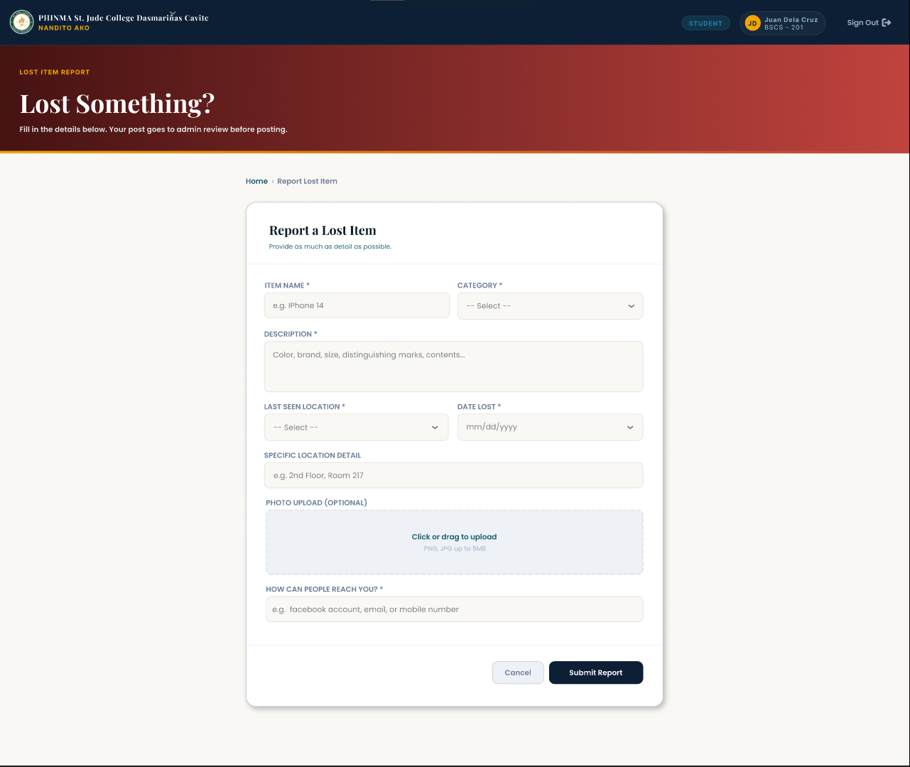
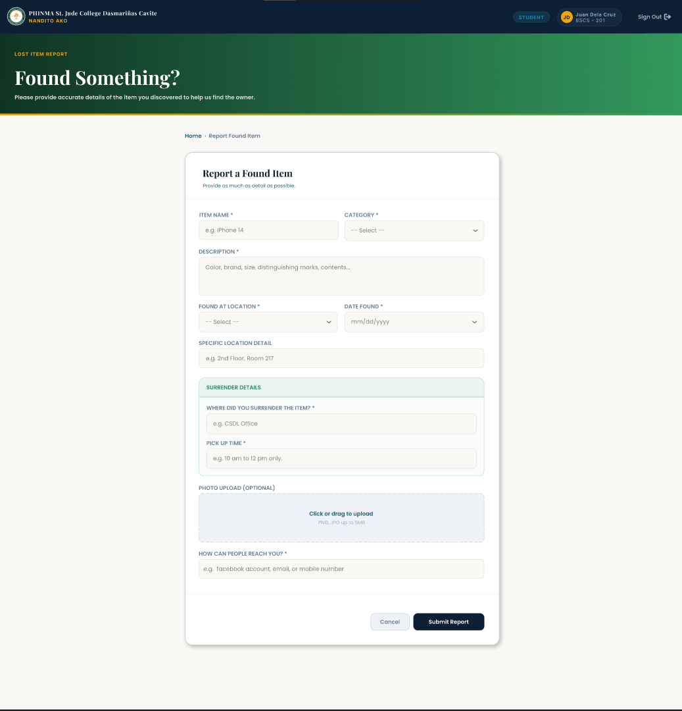

# Nandito Ako

A dedicated Lost & Found web portal for **PHINMA St. Jude College Dasmariñas Cavite** that replaces scattered, easily-buried Facebook Freedom Wall posts with a centralized, searchable database.

> "Find What Matters. Return What Isn't Yours."

## The Problem

Lost and found posts on the school's Facebook Freedom Wall get buried under daily updates, have no organization or categories, and force students to scroll endlessly or rely on shares/tags — often leading to unclaimed items and wasted time. **Nandito Ako** solves this by giving lost-and-found listings their own dedicated, searchable home.

## Features

- **Searchable Database** — find items by keyword instead of scrolling through social media
- **Attribute Filtering** — filter by category (gadgets, documents, wallets), location (ICT room, canteen, library), and status (lost/found)
- **Upload-Driven Reporting** — quick form (under a minute) with photo upload for found/lost items
- **Real-Time Status Tracking** — items marked as lost, found, or claimed
- **Dedicated Dashboards** — separate, organized sections for lost and found listings
- **Data Persistence** — listings stay active until resolved, unlike social media posts that get buried
- **Privacy & Safety** — no need to post personal info (like IDs) publicly to claim or return items

## Demo

Since the deployment isn't live anymore, here are the Figma prototype screens showing the full user flow:

| Login | Home / Dashboard |
|---|---|
|  |  |

| Report Lost Item | Report Found Item |
|---|---|
|  |  |

| Item Details (Found) | Item Details (Lost) |
|---|---|
|  |  |

| Claim Success | Report Submitted |
|---|---|
|  |  |

*Full user flow diagram:*


## Tech Stack

**Backend & Security**
- Django (Python) — routing, authentication, secure requests

**Database**
- PostgreSQL

**Frontend**
- HTML, CSS, Tailwind CSS
- Designed in Figma before development

**Dev Tools**
- PyCharm, VS Code
- Git / GitHub for version control

## How It Works

1. **Secure Login** — users log in through the Django-powered portal, verified against PostgreSQL
2. **Dashboard Browsing** — browse a structured, filterable grid of lost/found items
3. **Report an Item** — fill out a structured form (category, location, description, photo)
4. **Submission** — report is saved and instantly reflected on the public dashboard
5. **Claim & Recovery** — owner initiates a claim, system connects owner and finder for retrieval

## Getting Started

```bash
# clone the repo
git clone https://github.com/DevDrew01/Lost-FoundSJCDC.git
cd Lost-FoundSJCDC

# create and activate a virtual environment
python -m venv venv
venv\Scripts\activate      # Windows
source venv/bin/activate   # macOS/Linux

# install dependencies
pip install -r requirements.txt

# run migrations
python manage.py migrate

# create a superuser (for admin access)
python manage.py createsuperuser

# run the development server
python manage.py runserver
```

Then visit `http://127.0.0.1:8000` in your browser.

> Note: You'll need a local PostgreSQL database set up and configured in `Project/settings.py` before running migrations.

## Project Status

This was built as a school project for PHINMA St. Jude College Dasmariñas Cavite. Core CRUD functionality (report, view, claim) is implemented and tested. The project is not currently deployed live, but the codebase and Figma prototype are fully available for reference.

## Team

| Name | Role |
|---|---|
| Leo Andrew N. Agana | Backend Developer |
| Aiesha Yuwein D. Resuello | Frontend Designer & Developer |

## Impact

Nandito Ako reduces stress and time lost scrolling through unrelated posts, increases recovery chances by centralizing all listings in one searchable place, and encourages honesty and responsibility among students. For the school, it digitizes the traditional logbook system and provides a centralized record for monitoring lost-and-found activity.

---

*PHINMA St. Jude College Dasmariñas Cavite*
